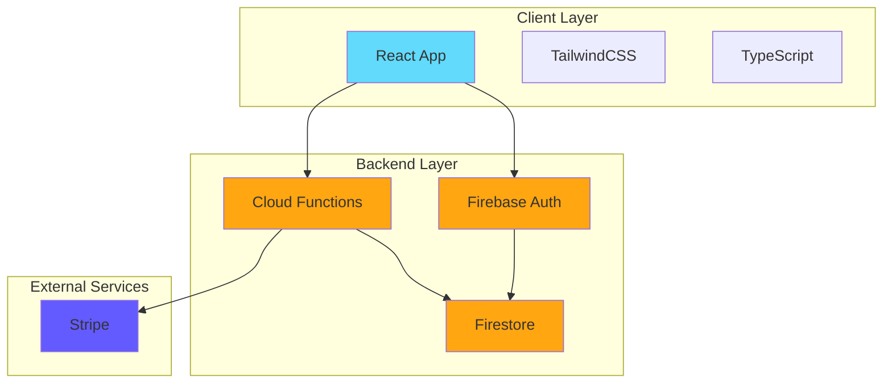
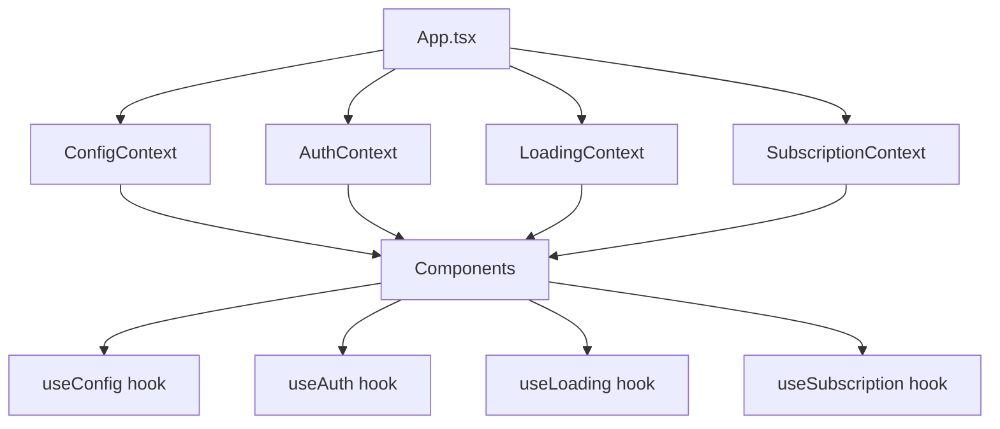
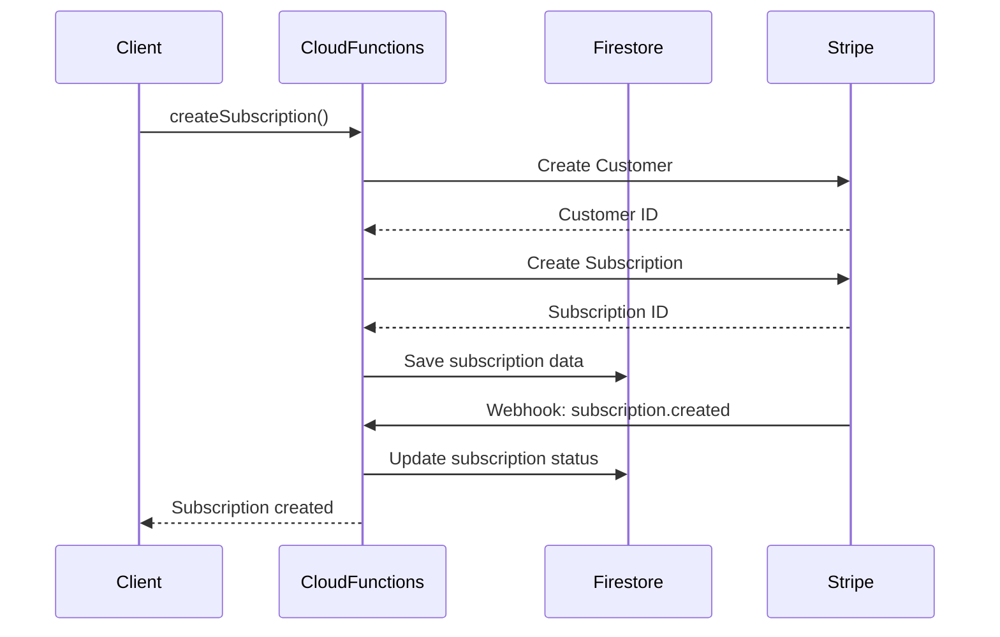
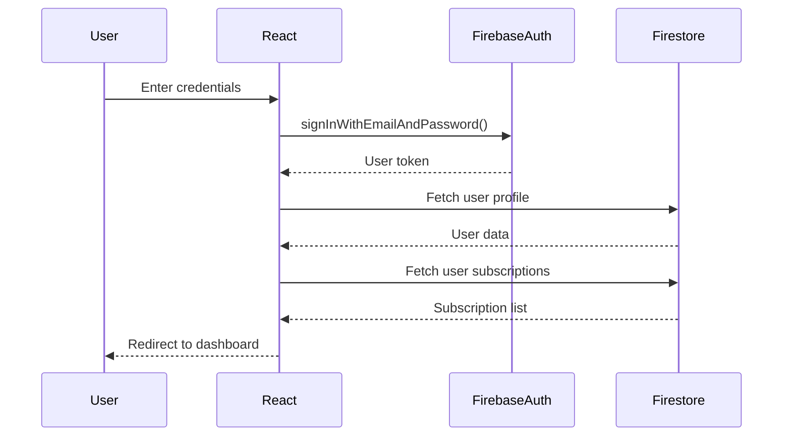
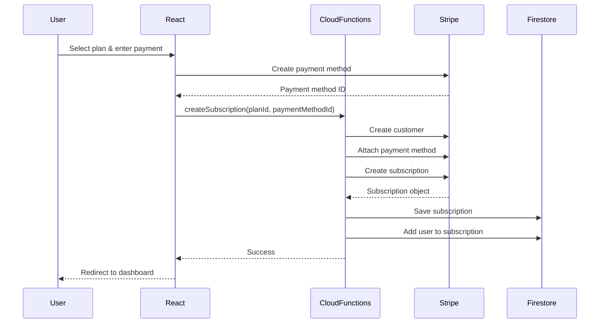
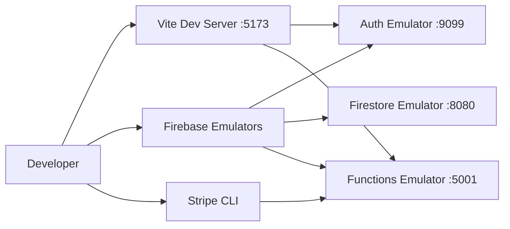

# Fireact.dev Architecture

This document provides a comprehensive overview of the Fireact.dev architecture, including system design, data flow, and key architectural decisions.

## Table of Contents

- [System Overview](#system-overview)
- [Repository Structure](#repository-structure)
- [Monorepo Architecture](#monorepo-architecture)
- [Frontend Architecture](#frontend-architecture)
- [Backend Architecture](#backend-architecture)
- [Data Model](#data-model)
- [Authentication Flow](#authentication-flow)
- [Subscription Flow](#subscription-flow)
- [Security Model](#security-model)
- [Scalability Considerations](#scalability-considerations)
- [Development Architecture](#development-architecture)

## System Overview

Fireact.dev is a full-stack SaaS framework built on modern web technologies:



### Technology Stack

**Frontend:**
- React 19 with TypeScript
- Vite for build tooling
- TailwindCSS for styling
- React Router for navigation
- i18next for internationalization

**Backend:**
- Firebase Authentication
- Cloud Functions (Node.js)
- Firestore (NoSQL database)
- Firebase Hosting

**External Services:**
- Stripe for payment processing
- Stripe Billing for subscription management

## Repository Structure

Fireact.dev uses a **multi-repo structure with Git submodules** to organize code:

```
fireact.dev/
├── source/              [Submodule] Main application code
├── create-fireact-app/  [Submodule] CLI scaffolding tool
├── demo/                [Submodule] Demo application
├── docs/                [Submodule] Documentation site (Hugo)
├── website/             [Submodule] Marketing site (Hugo)
└── test-app/            Testing application
```

### Why Submodules?

**Advantages:**
- Independent versioning for each component
- Separate repositories for specialized contributors
- Isolated CI/CD pipelines
- Modular development and deployment

**Trade-offs:**
- More complex setup for contributors
- Requires understanding of Git submodules
- Coordination needed for cross-module changes

## Monorepo Architecture

The `source/` submodule uses a **symlink-based monorepo** structure:

```
source/
├── src/                    # Actual source code
│   ├── components/        # React components
│   ├── contexts/          # React contexts
│   ├── hooks/             # Custom hooks
│   ├── config/            # Configuration files
│   └── utils/             # Utility functions
├── functions/              # Cloud Functions code
│   └── src/
│       └── functions/     # Individual functions
├── packages/
│   ├── app/               # NPM package for React app
│   │   └── src/          # Symlinks to ../../../src/
│   └── functions/         # NPM package for Cloud Functions
│       └── src/          # Symlinks to ../../../functions/src/
└── package.json           # Root package.json
```

### Symlink Architecture

The monorepo uses **symbolic links** to share code between the main source and NPM packages:

```bash
# Example symlinks in packages/app/src/
components -> ../../../src/components
contexts -> ../../../src/contexts
hooks -> ../../../src/hooks
config -> ../../../src/config
```

**Benefits:**
- Single source of truth for code
- Packages reference the same code without duplication
- Changes immediately reflected in both development and package builds
- Simplifies publishing to NPM

**Development Workflow:**
1. Developers work in `source/src/` and `source/functions/src/`
2. Packages in `source/packages/` link to the main source
3. CLI tool (`create-fireact-app`) uses published packages
4. No code duplication or synchronization needed

## Frontend Architecture

### Component Architecture

The React application follows a **component-based architecture** with clear separation of concerns:

```
src/
├── components/              # UI Components
│   ├── auth/               # Authentication components
│   ├── common/             # Reusable components
│   └── navigation/         # Navigation components
├── contexts/               # React Context providers
│   ├── AuthContext.tsx    # Authentication state
│   ├── ConfigContext.tsx  # App configuration
│   ├── LoadingContext.tsx # Loading states
│   └── SubscriptionContext.tsx  # Subscription state
├── hooks/                  # Custom React hooks
│   ├── useAuth.ts
│   ├── useConfig.ts
│   ├── useLoading.ts
│   └── useSubscription.ts
├── layouts/                # Page layouts
│   ├── PublicLayout.tsx   # For unauthenticated pages
│   ├── AuthenticatedLayout.tsx  # For authenticated pages
│   └── SubscriptionLayout.tsx   # For subscription pages
└── types.ts                # TypeScript type definitions
```

### State Management

Fireact.dev uses **React Context API** for state management:



**Context Hierarchy:**
1. **ConfigContext**: Application configuration (Firebase, Stripe, pages)
2. **AuthContext**: User authentication and profile data
3. **LoadingContext**: Global loading states
4. **SubscriptionContext**: Current subscription data

### Routing Structure

The application uses **React Router v7** with protected routes:

```typescript
<Routes>
  {/* Public Routes */}
  <Route element={<PublicLayout />}>
    <Route path="/sign-in" element={<SignIn />} />
    <Route path="/sign-up" element={<SignUp />} />
    <Route path="/reset-password" element={<ResetPassword />} />
  </Route>

  {/* Authenticated Routes */}
  <Route element={<PrivateRoute />}>
    <Route element={<AuthenticatedLayout />}>
      <Route path="/profile" element={<Profile />} />

      {/* Subscription Routes */}
      <Route element={<ProtectedSubscriptionRoute />}>
        <Route element={<SubscriptionLayout />}>
          <Route path="/:subscriptionId/dashboard" element={<SubscriptionDashboard />} />
          <Route path="/:subscriptionId/settings" element={<SubscriptionSettings />} />
        </Route>
      </Route>
    </Route>
  </Route>
</Routes>
```

**Route Protection:**
- `PrivateRoute`: Requires authentication
- `ProtectedSubscriptionRoute`: Requires valid subscription + permissions

### Internationalization

Uses **i18next** for multi-language support:

```
src/i18n/
├── index.ts              # i18next configuration
├── locales/
│   ├── en/              # English translations
│   │   └── translation.json
│   ├── es/              # Spanish translations
│   │   └── translation.json
│   └── [other languages]
```

## Backend Architecture

### Cloud Functions Structure

Firebase Cloud Functions provide the backend API:

```
functions/src/
├── functions/                    # Individual function modules
│   ├── subscription/            # Subscription management
│   │   ├── createSubscription.ts
│   │   ├── cancelSubscription.ts
│   │   └── changeSubscriptionPlan.ts
│   ├── billing/                 # Billing operations
│   │   ├── getBillingDetails.ts
│   │   ├── updateBillingDetails.ts
│   │   └── getPaymentMethods.ts
│   ├── invite/                  # User invitation
│   │   ├── createInvite.ts
│   │   ├── acceptInvite.ts
│   │   └── rejectInvite.ts
│   └── stripe.ts                # Stripe webhook handler
├── config/                      # Configuration
│   ├── stripe.config.json      # Stripe keys and settings
│   └── plans.config.json       # Subscription plans
└── index.ts                     # Function exports
```

### Function Types

**Callable Functions** (HTTPS callable):
- Called directly from client with authentication
- Automatic request/response handling
- Built-in authentication context

**HTTP Functions**:
- `stripeWebhook`: Handles Stripe webhook events
- No authentication required (verified by Stripe signature)

### Stripe Integration

The backend integrates with Stripe for payment processing:



## Data Model

### Firestore Collections

```
firestore/
├── users/                              # User profiles
│   └── {userId}/
│       ├── displayName: string
│       ├── email: string
│       ├── photoURL: string
│       └── subscriptions/             # Subcollection
│           └── {subscriptionId}/
│               ├── id: string
│               ├── role: string
│               └── permissions: object
│
├── subscriptions/                      # Subscription data
│   └── {subscriptionId}/
│       ├── name: string
│       ├── ownerId: string
│       ├── planId: string
│       ├── stripeCustomerId: string
│       ├── stripeSubscriptionId: string
│       ├── status: string
│       ├── createdAt: timestamp
│       └── updatedAt: timestamp
│
├── invites/                            # Pending invitations
│   └── {inviteId}/
│       ├── subscriptionId: string
│       ├── email: string
│       ├── role: string
│       ├── permissions: object
│       ├── status: string
│       └── createdAt: timestamp
│
└── plans/                              # Subscription plans
    └── {planId}/
        ├── id: string
        ├── name: string
        ├── stripePriceId: string
        ├── currency: string
        ├── amount: number
        └── features: array
```

### Security Rules

Firestore security rules enforce access control:

```javascript
// Example security rules
match /subscriptions/{subscriptionId} {
  // Only subscription members can read
  allow read: if isSubscriptionMember(subscriptionId);

  // Only owners can update
  allow update: if isSubscriptionOwner(subscriptionId);

  // Only authenticated users can create
  allow create: if request.auth != null;
}
```

## Authentication Flow



### Authentication Methods

Supported authentication methods:
- Email/Password (built-in)
- Google OAuth (configurable)
- GitHub OAuth (configurable)
- Other providers (extensible)

## Subscription Flow

### Creating a Subscription



### Subscription Lifecycle

1. **Active**: Subscription is active and paid
2. **Past Due**: Payment failed, grace period
3. **Canceled**: User canceled, active until period end
4. **Unpaid**: Payment failed multiple times
5. **Incomplete**: Initial payment not completed

## Security Model

### Authentication Security

- Firebase Authentication handles secure token management
- ID tokens verified on every Cloud Function call
- Tokens refreshed automatically by Firebase SDK
- Session management handled by Firebase

### Authorization

**Role-Based Access Control (RBAC):**

```typescript
interface UserPermissions {
  access: boolean;           // Can access subscription
  updateSubscription: boolean;  // Can modify subscription settings
  manageUsers: boolean;      // Can invite/remove users
  manageBilling: boolean;    // Can update billing
  viewBilling: boolean;      // Can view billing details
}
```

**Permission Levels:**
- **Owner**: All permissions
- **Admin**: All except ownership transfer
- **Member**: Basic access permissions
- **Custom**: Configurable permissions

### Data Security

- Firestore security rules enforce server-side authorization
- Cloud Functions validate all inputs
- Sensitive data (API keys) stored in environment variables
- Stripe webhook signatures verified
- Payment details never stored in Firestore

## Scalability Considerations

### Frontend Scalability

- Static assets served via Firebase Hosting CDN
- Code splitting for optimal bundle size
- Lazy loading for route-based components
- Optimized images and assets

### Backend Scalability

- Cloud Functions auto-scale with demand
- Firestore scales automatically
- Indexed queries for optimal performance
- Pagination for large data sets
- Caching strategies for configuration data

### Cost Optimization

- Firebase free tier for development
- Pay-as-you-go for production
- Efficient Firestore queries to minimize reads
- Cloud Function cold starts minimized
- Stripe handles PCI compliance

## Development Architecture

### Local Development



### Build Pipeline

```
Source Code
    ↓
TypeScript Compilation
    ↓
Vite Build (React App)
    ↓
Functions Build (Cloud Functions)
    ↓
Firebase Deploy
    ↓
Production
```

### Deployment Architecture

```
GitHub Repository
    ↓
Git Push
    ↓
CI/CD (Cloud Build / GitHub Actions)
    ├─→ Build React App
    ├─→ Build Cloud Functions
    └─→ Run Tests
    ↓
Firebase Deploy
    ├─→ Hosting (React App)
    ├─→ Cloud Functions
    └─→ Firestore Rules & Indexes
    ↓
Production Environment
```

## Key Architectural Decisions

### Why Firebase?

- **Fully managed**: No server maintenance
- **Scalable**: Auto-scales with usage
- **Cost-effective**: Pay only for what you use
- **Integrated**: Auth, database, functions, hosting in one platform
- **Real-time**: Built-in real-time data synchronization

### Why Stripe?

- **Industry standard**: Trusted payment processor
- **Complete billing**: Subscription management built-in
- **Developer-friendly**: Excellent API and documentation
- **Compliant**: PCI compliance handled
- **Global**: Support for multiple currencies and payment methods

### Why React + TypeScript?

- **Type Safety**: Catch errors at compile time
- **Developer Experience**: Excellent tooling and IDE support
- **Maintainability**: Easier to refactor and maintain large codebases
- **Performance**: Optimized rendering with React 19
- **Ecosystem**: Rich ecosystem of libraries and tools

### Why Monorepo with Submodules?

- **Modularity**: Each component can be developed independently
- **Reusability**: Packages can be published to NPM
- **Flexibility**: Contributors can work on specific modules
- **Organization**: Clear separation of concerns

## Future Architecture Considerations

### Potential Enhancements

- **Testing**: Add unit and integration tests
- **Caching**: Implement Redis for caching
- **Search**: Add Algolia or Elasticsearch for search
- **Analytics**: Integrate analytics for usage tracking
- **Monitoring**: Add error tracking and performance monitoring
- **CDN**: Optimize asset delivery
- **Multi-region**: Deploy to multiple regions for lower latency

---

For more detailed information about specific components, refer to:
- [Source Code README](source/README.md)
- [API Documentation](https://docs.fireact.dev)
- [Contributing Guidelines](CONTRIBUTING.md)
