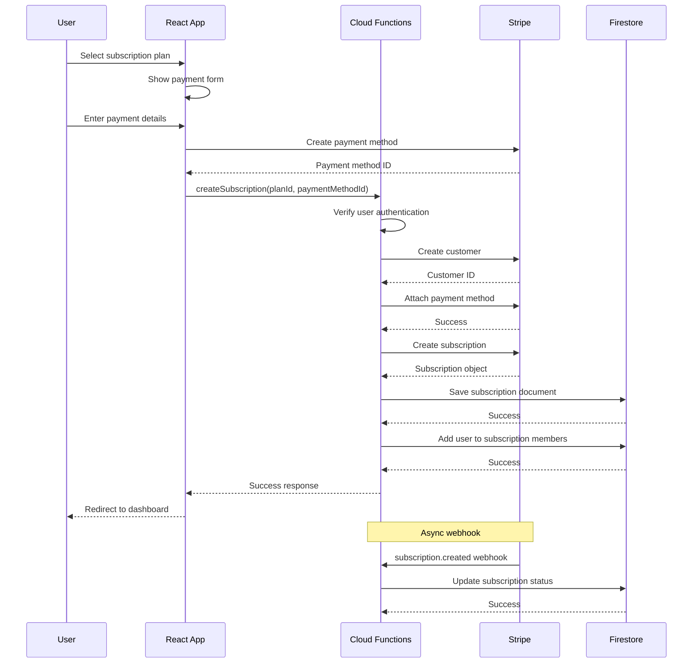

# Fireact.dev Architecture Diagrams

This document contains detailed architecture diagrams for Fireact.dev. These diagrams complement the [ARCHITECTURE.md](ARCHITECTURE.md) documentation.

## Table of Contents

- [Complete Data Flow](#complete-data-flow)
- [User Authentication Flow](#user-authentication-flow)
- [Subscription Creation Flow](#subscription-creation-flow)
- [Payment Processing Flow](#payment-processing-flow)
- [Team Invitation Flow](#team-invitation-flow)
- [Component Interaction](#component-interaction)

## Complete Data Flow

## User Authentication Flow

### Sign-Up Process

### Sign-In Process

### Social Login Flow

## Subscription Creation Flow

## Payment Processing Flow

### Successful Payment

### Failed Payment

## Team Invitation Flow

## Component Interaction

### React Component Hierarchy

### Data Flow in Components

## Cloud Functions Architecture

## Security Architecture

## Deployment Pipeline

## Real-time Sync Architecture

## Error Handling Flow

---

## Diagram Legend

- **Blue**: Client-side (React)
- **Orange**: Firebase services
- **Purple**: Stripe services
- **Yellow**: Decision points
- **Green**: Success states
- **Red**: Error states
- **Solid lines**: Synchronous flow
- **Dashed lines**: Asynchronous flow

## Generating Diagrams

These diagrams are written in Mermaid syntax and can be:

1. **Viewed on GitHub**: GitHub automatically renders Mermaid diagrams
2. **Rendered in VS Code**: Use the Mermaid Preview extension
3. **Exported as images**: Use the Mermaid CLI or online editor
4. **Embedded in documentation**: Most markdown renderers support Mermaid

## Related Documentation

- [Architecture Overview](ARCHITECTURE.md)
- [Security Model](ARCHITECTURE.md#security-model)
- [Data Model](ARCHITECTURE.md#data-model)
- [Contributing Guidelines](CONTRIBUTING.md)
