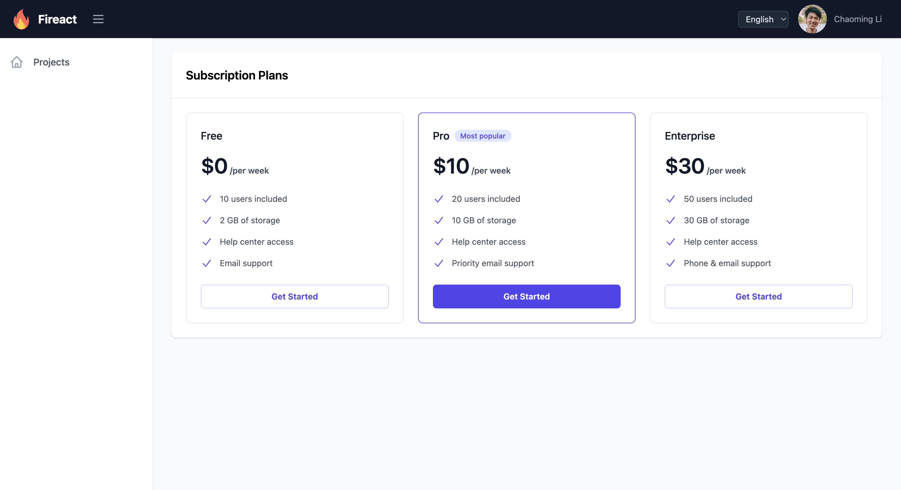

# fireact.dev

A comprehensive open-source framework for building production-ready SaaS applications with Firebase, React, TypeScript, and Stripe integration.

## Overview

fireact.dev provides a complete foundation for building modern SaaS applications. It combines industry-standard technologies and best practices to help developers launch their SaaS products faster and more efficiently.

## Demo



Visit our [demos page](https://fireact.dev/demos/) to explore live demonstrations of both the Core and SaaS versions, showcasing the full range of features and capabilities.

## Features

### Features
- **Authentication & User Management**
  - Complete authentication system (sign-up, sign-in, password reset)
  - User profile management
  - Role-based access control
  - Team member invitations and permissions
- **Subscription Management**
  - Multiple subscription plans support
  - Stripe integration for payment processing
  - Billing portal and invoice management
  - Payment method management
  - Subscription upgrades and downgrades

### Developer Experience
- TypeScript for better code quality
- TailwindCSS for responsive design
- Firebase emulator support for local development
- Comprehensive documentation
- Modular architecture

## Project Structure

The repository is organized into several key directories:

- **`source/`**: This directory contains the complete, combined source code for the Fireact.dev project, including both the React frontend application and Firebase Cloud Functions backend code. It follows a monorepo structure with `packages/app` for the React app and `packages/functions` for the Cloud Functions.
- **`create-fireact-app/`**: Contains the CLI tool used to scaffold new Fireact applications.
- **`website/`**: The main marketing website for fireact.dev, built with Hugo.
- **`docs/`**: The documentation website for fireact.dev, built with Hugo.
- **`demo/`**: Contains the demo application.

## Getting Started

To create a new Fireact application, use the `create-fireact-app` CLI tool. This tool will guide you through the setup process, including Firebase and Stripe configurations.

1. **Install the CLI (if you haven't already)**:
   ```bash
   npm install -g create-fireact-app
   ```

2. **Create a new project**:
   ```bash
   create-fireact-app <your-project-name>
   ```
   Replace `<your-project-name>` with the desired name for your new application.

3. **Follow the prompts**: The CLI will guide you through selecting your Firebase project and configuring Stripe.

4. **After creation**:
   Navigate into your new project directory:
   ```bash
   cd <your-project-name>
   ```
   Then, build the application and functions, and start the emulators:
   ```bash
   npm run build && cd functions && npm run build && cd ..
   firebase emulators:start
   ```
   For Stripe webhook testing, in a separate terminal:
   ```bash
   stripe listen --forward-to http://127.0.0.1:5001/<your-firebase-project-id>/us-central1/stripeWebhook
   ```
   Remember to update `functions/src/config/stripe.config.json` with the new webhook endpoint secret and rebuild functions (`cd functions && npm run build`) if the webhook secret changes.

## Tech Stack

- **Frontend**: React, TypeScript, TailwindCSS
- **Backend**: Firebase (Authentication, Firestore, Cloud Functions)
- **Payment Processing**: Stripe
- **Development Tools**: Vite, ESLint, PostCSS

## Documentation

Visit [fireact.dev](https://fireact.dev) for comprehensive documentation, including:

- Getting Started Guide
- Component Documentation
- API Reference
- Best Practices
- Deployment Guide

## Contributing

We welcome contributions! Please read our contributing guidelines before submitting pull requests.

## License

This project is open source and available under the [MIT License](LICENSE).

## Support

- Website: [fireact.dev](https://fireact.dev)
- GitHub Issues: For bug reports and feature requests
